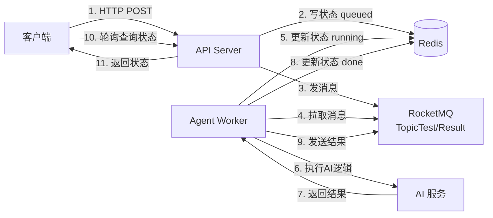

# Agent Production - 异步任务处理系统

基于 FastAPI + RocketMQ + Redis 的高并发异步任务处理系统，专为 AI Agent 耗时任务设计。

## 📋 项目简介

这是一个生产级的异步任务处理系统，采用微服务架构设计，旨在解决 AI Agent 场景下的长耗时任务处理问题。

- **高并发**: API 层与 Worker 层分离，通过 MQ 削峰填谷。
- **可扩展**: Worker 采用插件式 Agent 设计，轻松扩展新的业务逻辑。
- **可靠性**: 全链路状态追踪，Redis 缓存状态，RocketMQ 保证消息不丢失。
- **流控**: Worker 内置信号量机制，精确控制并发任务数，防止过载。

## 🏗️ 项目结构

```
agent_prod/
├── app/
│   ├── api/                # API 接口定义
│   │   ├── tasks_api.py    # 任务管理接口
│   │   └── worker_api.py   # Worker 启动逻辑
│   ├── core/               # 核心配置与工具
│   ├── models/             # Pydantic 数据模型
│   ├── self_agents/        # Agent 插件目录 (开发重心)
│   │   ├── base_agent.py   # Agent 基类
│   │   ├── mock_agent.py   # 示例 Agent
│   │   └── __init__.py     # Agent 注册表
│   ├── services/           # 基础设施服务 (Redis, MQ, ProxyAgent)
│   ├── run_tasks_api.py    # API 服务入口
│   └── run_worker_api.py   # Worker 服务入口
├── test/                   # 测试脚本
├── .env                    # 环境变量配置
└── pyproject.toml          # 项目依赖管理
```

## 🚀 快速开始

### 1. 环境准备

- **Python 3.12+**
- **Redis**: 用于存储任务状态
- **RocketMQ 5.x**: 用于任务队列和结果分发

### 2. 安装依赖

本项目使用 `uv` 进行包管理（也支持 pip）。

```bash
# 使用 uv (推荐)
uv sync

# 或使用 pip
pip install -e .
```

### 3. 配置环境变量

复制 `.env.example` 为 `.env` 并按需修改：

```bash
cp .env.example .env
```

主要配置项：
```env
# Redis
REDIS_HOST=localhost
REDIS_PORT=6379

# RocketMQ
MQ_ENDPOINT=127.0.0.1:8081
MQ_TOPIC_REQUEST=TopicTest
MQ_TOPIC_RESULT=TopicResult
MQ_GROUP_AGENT=GID_AGENT_PYTHON
```

### 4. 初始化 RocketMQ 资源

在启动服务前，必须在 RocketMQ 中创建好 Topic 和 Consumer Group。

| 类型 | 名称 (默认) | 说明 |
|------|------------|------|
| **Topic** | `TopicTest` | **请求队列**: API 发送任务，Worker 消费 |
| **Topic** | `TopicResult` | **结果队列**: Worker 发送结果，下游服务消费 |
| **Group** | `GID_AGENT_PYTHON` | **Worker 组**: 用于 Worker 负载均衡消费 |

可以通过 RocketMQ Dashboard 或 `mqadmin` 工具创建。
#### Topic 和 Consumer Group 的区别

**Topic (主题)**
- 消息的分类标签，类似于"邮箱地址"
- Producer 发送消息到 Topic
- Consumer 订阅 Topic 来接收消息
- 一个 Topic 可以有多个 Consumer Group 订阅

**Consumer Group (消费者组)**
- 一组消费者的集合，共同消费同一个 Topic
- 同一个 Group 内的多个 Consumer 会**负载均衡**消费消息（每条消息只被组内一个 Consumer 消费）
- 不同 Group 的 Consumer 会**各自独立**消费所有消息（广播模式）

**示例：**
```
TopicTest (请求 Topic)
├── GID_AGENT_PYTHON (Worker 组) → Worker1, Worker2, Worker3 (负载均衡)
└── GID_MONITOR (监控组) → Monitor1 (独立消费所有消息)

TopicResult (结果 Topic)
└── GID_JAVA_SERVICE (Java 服务组) → JavaService1, JavaService2 (负载均衡)
```

#### 创建 Topic 和 Consumer Group

**方式 1: 使用 mqadmin 命令行工具**

```bash
# 如果在 Docker 中运行 RocketMQ
docker exec -it <broker_container_id> bash
cd /home/rocketmq/rocketmq-5.x.x/bin

# 创建 Topic: TopicTest (请求 Topic)
sh mqadmin updateTopic -n 127.0.0.1:9876 -c DefaultCluster -t TopicTest

# 创建 Topic: TopicResult (结果 Topic)
sh mqadmin updateTopic -n 127.0.0.1:9876 -c DefaultCluster -t TopicResult

# 创建 Consumer Group: GID_AGENT_PYTHON
sh mqadmin updateSubGroup -n 127.0.0.1:9876 -c DefaultCluster -g GID_AGENT_PYTHON
```

**方式 2: 使用 RocketMQ Dashboard (推荐)**

1. 打开 Dashboard: `http://localhost:8080`
2. 创建 Topic:
   - 点击 **Topic** → **ADD/UPDATE**
   - Cluster Name: `DefaultCluster`
   - Topic Name: `TopicTest` 或 `TopicResult`
   - Write Queue Nums: `16`
   - Read Queue Nums: `16`
3. 创建 Consumer Group:
   - 点击 **Consumer** → **ADD/UPDATE**
   - Cluster Name: `DefaultCluster`
   - Consumer Group Name: `GID_AGENT_PYTHON`

### 5. 启动服务

**启动 API Server:**

```bash
python app/run_tasks_api.py
```
API 服务将在 `http://0.0.0.0:8000` 启动。

**启动 Worker:**

```bash
python app/run_worker_api.py
```
Worker 启动后会连接 RocketMQ 并开始监听任务。

## 📡 API 使用

### 创建任务

```bash
curl -X POST http://localhost:8000/api/v1/tasks \
  -H "Content-Type: application/json" \
  -d '{
    "user_id": "user123",
    "content": "帮我分析这款智能手表"
  }'
```

响应：
```json
{
  "task_id": "550e8400-e29b-41d4-a716-446655440000",
  "status": "queued"
}
```

### 查询任务状态

```bash
curl http://localhost:8000/api/v1/tasks/550e8400-e29b-41d4-a716-446655440000
```

响应：
```json
{
  "task_id": "550e8400-e29b-41d4-a716-446655440000",
  "status": "done",
  "result": null
}
```
> **注意**: API 仅返回任务状态 (`queued`, `running`, `done`, `failed`)。具体的**处理结果** (payload) 会发送到 `TopicResult` 供下游业务系统消费，不会存储在 Redis 中。

## 🔄 数据流程



## 🛠️ 二次开发指南

### 添加新的 Agent

所有的业务逻辑都封装在 Agent 中。要添加新的处理逻辑：

1.  **新建 Agent 类**: 在 `app/self_agents/` 下创建一个新文件，继承 `BaseAgent`。

## 🧪 测试

### 运行完整流程测试

项目提供了一个完整的测试脚本，演示整个数据流程：

```bash
python tests/test_full_flow.py
```

**测试脚本功能：**

1. **发送任务请求** - 通过 HTTP API 创建任务
2. **查询任务状态** - 轮询 Redis 状态直到完成
3. **从 MQ 获取结果** - 订阅 `TopicResult` 接收处理结果

**示例输出：**

```
============================================================
🧪 开始测试完整流程
============================================================

📤 步骤 1: 发送任务请求
请求数据: {
  "user_id": "test_user_001",
  "content": "测试：智能手表降价通知"
}
✅ 任务已创建
Task ID: 71f550aa-aa95-4d8a-bcc4-5b51352334e0

🔍 步骤 2: 查询任务状态
[1/10] 当前状态: running
[2/10] 当前状态: running
[3/10] 当前状态: done
✅ 任务已完成

🔍 步骤 3: 从 MQ 获取处理结果
✅ 收到目标任务的结果消息！
📊 处理结果:
  - 标签: ['数码', '降价敏感']
  - 评分: 95
  - 原因: 用户关注了内容: 测试：智能手表降价通知

============================================================
🎉 测试完成
============================================================
```

    ```python
    # app/self_agents/my_agent.py
    from app.self_agents.base_agent import BaseAgent

    class MyAgent(BaseAgent):
        def __init__(self):
            super().__init__(agent_type="my_agent")

        async def prepare_input(self, payload):
            return payload.get("content")

        async def process(self, task_id, prepared_input):
            # 你的 AI 逻辑
            return {"result": f"Processed: {prepared_input}"}

        async def parse_response(self, raw_result):
            return {"success": True, "data": raw_result}
    ```

2.  **注册 Agent**: 修改 `app/self_agents/__init__.py`。

    ```python
    from app.self_agents.my_agent import MyAgent

    _AGENT_REGISTRY = {
        "mock_agent": MockAgent,
        "my_agent": MyAgent,  # 新增
    }
    ```

3.  **调用**: 创建任务时，在 payload 中指定 `agent_type` (目前默认为 `mock_agent`，未来可扩展参数支持动态指定)。

## 🧪 测试

项目包含一个完整的集成测试脚本，模拟了"提交任务 -> 轮询状态 -> 接收结果"的全流程。

```bash
python test/test_full_flow.py
# 注意：你需要先启动 API 和 MQ 才能运行此测试
```

## 🐛 常见问题

**Q: Worker 启动成功但收不到消息？**
A: 请确保：
1. RocketMQ 的 Topic 和 Consumer Group 已正确创建。
2. 确保 API 和 Worker 连接的是同一个 Nameserver。
3. 如果是 Docker 环境，注意 Broker IP 暴露问题。

**Q: 如何调整并发数？**
A: 在 `app/services/proxy_agent.py` 中初始化 `ProxyAgent` 时调整 `max_concurrent_tasks` 参数（默认 10）。

### 端口被占用？

```bash
# 查找占用 8000 端口的进程
lsof -ti:8000 | xargs kill -9
```

## 结束进程的命令

pkill -f run_tasks_api && pkill -f run_worker_api