# Agent Production - 异步任务处理系统

基于 FastAPI + RocketMQ + Redis 的异步任务处理系统，用于处理 AI Agent 相关的耗时任务。

## 📋 项目简介

这是一个生产级的异步任务处理系统，采用微服务架构设计：

- **API Server**: 接收 HTTP 请求，快速返回任务 ID
- **Agent Worker**: 后台消费 MQ 消息，执行耗时的 AI 处理逻辑
- **消息队列**: 使用 RocketMQ 解耦 API 和 Worker
- **缓存**: 使用 Redis 存储任务状态和结果

## 🏗️ 项目结构

```
agent_prod/
├── api/                    # API 服务模块
│   ├── __init__.py
│   └── server.py          # FastAPI 应用
├── worker/                # Worker 服务模块
│   ├── __init__.py
│   ├── consumer.py        # RocketMQ 消费者
│   └── agent_logic.py     # 业务处理逻辑
├── common/                # 共享模块
│   ├── __init__.py
│   ├── config.py          # 配置管理
│   ├── models.py          # 数据模型
│   └── redis_client.py    # Redis 客户端
├── run_tasks_api.py       # API 服务启动入口
├── run_worker_api.py      # Worker 服务启动入口
├── .env                   # 环境变量配置
└── pyproject.toml         # 项目依赖
```

## 🚀 快速开始

### 1. 环境要求

- Python 3.12+
- Redis
- RocketMQ 5.x

### 2. 安装依赖

```bash
# 使用 uv (推荐)
uv sync

# 或使用 pip
pip install -e .
```

### 3. 配置环境变量

复制 `.env.example` 为 `.env` 并修改配置：

```bash
cp .env.example .env
```

配置示例：

```env
# Redis 配置
REDIS_HOST=localhost
REDIS_PORT=6379

# RocketMQ 配置
MQ_ENDPOINT=127.0.0.1:8081
MQ_TOPIC_REQUEST=TopicTest
MQ_TOPIC_RESULT=TopicResult
MQ_GROUP_AGENT=GID_AGENT_PYTHON
MQ_ACCESS_KEY=User
MQ_SECRET_KEY=Secret
```

### 4. 配置 RocketMQ

#### Topic 和 Consumer Group 的区别

**Topic (主题)**
- 消息的分类标签，类似于"邮箱地址"
- Producer 发送消息到 Topic
- Consumer 订阅 Topic 来接收消息
- 一个 Topic 可以有多个 Consumer Group 订阅

**Consumer Group (消费者组)**
- 一组消费者的集合，共同消费同一个 Topic
- 同一个 Group 内的多个 Consumer 会**负载均衡**消费消息（每条消息只被组内一个 Consumer 消费）
- 不同 Group 的 Consumer 会**各自独立**消费所有消息（广播模式）

**示例：**
```
TopicTest (请求 Topic)
├── GID_AGENT_PYTHON (Worker 组) → Worker1, Worker2, Worker3 (负载均衡)
└── GID_MONITOR (监控组) → Monitor1 (独立消费所有消息)

TopicResult (结果 Topic)
└── GID_JAVA_SERVICE (Java 服务组) → JavaService1, JavaService2 (负载均衡)
```

#### 创建 Topic 和 Consumer Group

**方式 1: 使用 mqadmin 命令行工具**

```bash
# 如果在 Docker 中运行 RocketMQ
docker exec -it <broker_container_id> bash
cd /home/rocketmq/rocketmq-5.x.x/bin

# 创建 Topic: TopicTest (请求 Topic)
sh mqadmin updateTopic -n 127.0.0.1:9876 -c DefaultCluster -t TopicTest

# 创建 Topic: TopicResult (结果 Topic)
sh mqadmin updateTopic -n 127.0.0.1:9876 -c DefaultCluster -t TopicResult

# 创建 Consumer Group: GID_AGENT_PYTHON
sh mqadmin updateSubGroup -n 127.0.0.1:9876 -c DefaultCluster -g GID_AGENT_PYTHON
```

**方式 2: 使用 RocketMQ Dashboard (推荐)**

1. 打开 Dashboard: `http://localhost:8080`
2. 创建 Topic:
   - 点击 **Topic** → **ADD/UPDATE**
   - Cluster Name: `DefaultCluster`
   - Topic Name: `TopicTest` 或 `TopicResult`
   - Write Queue Nums: `16`
   - Read Queue Nums: `16`
3. 创建 Consumer Group:
   - 点击 **Consumer** → **ADD/UPDATE**
   - Cluster Name: `DefaultCluster`
   - Consumer Group Name: `GID_AGENT_PYTHON`

### 5. 启动服务

**启动 API Server:**

```bash
python run_tasks_api.py
```

API 服务将在 `http://0.0.0.0:8000` 启动

**启动 Worker:**

```bash
python run_worker_api.py
```

## 📡 API 使用

### 创建任务

```bash
curl -X POST http://localhost:8000/tasks \
  -H "Content-Type: application/json" \
  -d '{
    "user_id": "user123",
    "content": "机械键盘降价了"
  }'
```

响应：

```json
{
  "task_id": "550e8400-e29b-41d4-a716-446655440000",
  "status": "queued"
}
```

### 查询任务状态

```bash
curl http://localhost:8000/tasks/550e8400-e29b-41d4-a716-446655440000
```

响应：

```json
{
  "task_id": "550e8400-e29b-41d4-a716-446655440000",
  "status": "done",
  "result": null
}
```

> **注意**: 从 v2.0 开始，处理结果不再存储在 Redis 中，而是发送到 `TopicResult` 供下游服务消费。

## 🔄 数据流程

```mermaid
graph LR
    A[客户端] -->|1. HTTP POST| B[API Server]
    B -->|2. 写状态 queued| C[(Redis)]
    B -->|3. 发消息| D[RocketMQ<br/>TopicTest/Result]
    E[Agent Worker] -->|4. 拉取消息| D
    E -->|5. 更新状态 running| C
    E -->|6. 执行AI逻辑| F[AI 服务]
    F -->|7. 返回结果| E
    E -->|8. 更新状态 done| C
    E -->|9. 发送结果| D
    A -->|10. 轮询查询状态| B
    B -->|11. 返回状态| A
```



**说明：**
- **Redis**: 只存储任务状态 (`queued` → `running` → `done`)
- **TopicTest**: 请求 Topic，API Server 发送任务到此
- **TopicResult**: 结果 Topic，Worker 发送处理结果到此
- **Agent Worker**: 采用 pull 模式从 `TopicTest` 拉取任务进行处理
- **下游服务**: 采用 pull 模式从 `TopicResult` 拉取处理结果（如 Java 画像服务）


## 🧪 测试

### 运行完整流程测试

项目提供了一个完整的测试脚本，演示整个数据流程：

```bash
python tests/test_full_flow.py
```

**测试脚本功能：**

1. **发送任务请求** - 通过 HTTP API 创建任务
2. **查询任务状态** - 轮询 Redis 状态直到完成
3. **从 MQ 获取结果** - 订阅 `TopicResult` 接收处理结果

**示例输出：**

```
============================================================
🧪 开始测试完整流程
============================================================

📤 步骤 1: 发送任务请求
请求数据: {
  "user_id": "test_user_001",
  "content": "测试：智能手表降价通知"
}
✅ 任务已创建
Task ID: 71f550aa-aa95-4d8a-bcc4-5b51352334e0

🔍 步骤 2: 查询任务状态
[1/10] 当前状态: running
[2/10] 当前状态: running
[3/10] 当前状态: done
✅ 任务已完成

� 步骤 3: 从 MQ 获取处理结果
✅ 收到目标任务的结果消息！
📊 处理结果:
  - 标签: ['数码', '降价敏感']
  - 评分: 95
  - 原因: 用户关注了内容: 测试：智能手表降价通知

============================================================
🎉 测试完成
============================================================
```

### 手动测试

**1. 创建任务**

```bash
curl -X POST http://localhost:8000/tasks \
  -H "Content-Type: application/json" \
  -d '{
    "user_id": "user123",
    "content": "机械键盘降价了"
  }'
```

**2. 查询状态**

```bash
curl http://localhost:8000/tasks/<task_id>
```

**3. 订阅结果 Topic (Java 示例)**

```java
import org.apache.rocketmq.client.consumer.DefaultMQPushConsumer;
import org.apache.rocketmq.client.consumer.listener.*;
import org.apache.rocketmq.common.message.MessageExt;

public class ResultConsumer {
    public static void main(String[] args) throws Exception {
        DefaultMQPushConsumer consumer = new DefaultMQPushConsumer("GID_JAVA_SERVICE");
        consumer.setNamesrvAddr("127.0.0.1:9876");
        consumer.subscribe("TopicResult", "*");
        
        consumer.registerMessageListener(new MessageListenerConcurrently() {
            @Override
            public ConsumeConcurrentlyStatus consumeMessage(
                List<MessageExt> msgs, ConsumeConcurrentlyContext context) {
                for (MessageExt msg : msgs) {
                    String body = new String(msg.getBody());
                    System.out.println("收到结果: " + body);
                    // 解析 JSON 并处理结果
                }
                return ConsumeConcurrentlyStatus.CONSUME_SUCCESS;
            }
        });
        
        consumer.start();
        System.out.println("Java 服务已启动，等待结果...");
    }
}
```

## �🛠️ 开发指南

### 添加新的业务逻辑

修改 `worker/agent_logic.py` 中的 `core_agent_logic` 函数：

```python
async def core_agent_logic(task_id: str, payload: str) -> TaskResult:
    # 1. 状态检查
    # 2. 更新为 running
    # 3. 执行你的业务逻辑
    # 4. 生成结果
    # 5. 更新状态为 done 并返回结果
    return TaskResult(...)
```

### 修改数据模型

在 `common/models.py` 中定义新的 Pydantic 模型：

```python
class YourModel(BaseModel):
    field1: str
    field2: int
```

## 📝 注意事项

1. **Worker 启动延迟**: Worker 启动后需要等待 5-10 秒让 RocketMQ 分配消息队列
2. **幂等性**: 业务逻辑已实现幂等性检查，重复消费不会重复处理
3. **优雅关闭**: 使用 Ctrl+C 停止服务时会自动清理资源

## 🐛 常见问题

### Worker 收不到消息？

1. 检查 RocketMQ 是否正常运行
2. 确认 Topic 和 Consumer Group 已创建
3. Worker 启动后等待 10 秒再发送测试请求

### 端口被占用？

```bash
# 查找占用 8000 端口的进程
lsof -ti:8000 | xargs kill -9
```

## 结束进程的命令

pkill -f run_tasks_api && pkill -f run_worker_api