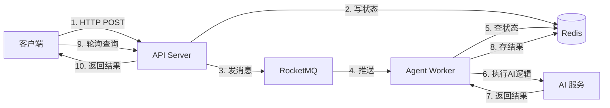

# Agent Production - 异步任务处理系统

基于 FastAPI + RocketMQ + Redis 的异步任务处理系统，用于处理 AI Agent 相关的耗时任务。

## 📋 项目简介

这是一个生产级的异步任务处理系统，采用微服务架构设计：

- **API Server**: 接收 HTTP 请求，快速返回任务 ID
- **Agent Worker**: 后台消费 MQ 消息，执行耗时的 AI 处理逻辑
- **消息队列**: 使用 RocketMQ 解耦 API 和 Worker
- **缓存**: 使用 Redis 存储任务状态和结果

## 🏗️ 项目结构

```
agent_prod/
├── api/                    # API 服务模块
│   ├── __init__.py
│   └── server.py          # FastAPI 应用
├── worker/                # Worker 服务模块
│   ├── __init__.py
│   ├── consumer.py        # RocketMQ 消费者
│   └── agent_logic.py     # 业务处理逻辑
├── common/                # 共享模块
│   ├── __init__.py
│   ├── config.py          # 配置管理
│   ├── models.py          # 数据模型
│   └── redis_client.py    # Redis 客户端
├── run_api.py             # API 服务启动入口
├── run_worker.py          # Worker 服务启动入口
├── .env                   # 环境变量配置
└── pyproject.toml         # 项目依赖
```

## 🚀 快速开始

### 1. 环境要求

- Python 3.12+
- Redis
- RocketMQ 5.x

### 2. 安装依赖

```bash
# 使用 uv (推荐)
uv sync

# 或使用 pip
pip install -e .
```

### 3. 配置环境变量

复制 `.env.example` 为 `.env` 并修改配置：

```bash
cp .env.example .env
```

配置示例：

```env
# Redis 配置
REDIS_HOST=localhost
REDIS_PORT=6379

# RocketMQ 配置
MQ_ENDPOINT=127.0.0.1:8081
MQ_TOPIC_REQUEST=TopicTest
MQ_GROUP_AGENT=GID_AGENT_PYTHON
MQ_ACCESS_KEY=User
MQ_SECRET_KEY=Secret
```

### 4. 启动服务

**启动 API Server:**

```bash
python run_api.py
```

API 服务将在 `http://0.0.0.0:8000` 启动

**启动 Worker:**

```bash
python run_worker.py
```

## 📡 API 使用

### 创建任务

```bash
curl -X POST http://localhost:8000/tasks \
  -H "Content-Type: application/json" \
  -d '{
    "user_id": "user123",
    "content": "机械键盘降价了"
  }'
```

响应：

```json
{
  "task_id": "550e8400-e29b-41d4-a716-446655440000",
  "status": "queued"
}
```

### 查询任务状态

```bash
curl http://localhost:8000/tasks/550e8400-e29b-41d4-a716-446655440000
```

响应：

```json
{
  "task_id": "550e8400-e29b-41d4-a716-446655440000",
  "status": "done",
  "result": {
    "tags": ["数码", "降价敏感"],
    "score": 95,
    "reason": "用户关注了内容: 机械键盘降价了"
  }
}
```

## 🔄 数据流程



## 🛠️ 开发指南

### 添加新的业务逻辑

修改 `worker/agent_logic.py` 中的 `core_agent_logic` 函数：

```python
async def core_agent_logic(task_id: str, payload: str) -> None:
    # 1. 状态检查
    # 2. 更新为 running
    # 3. 执行你的业务逻辑
    # 4. 生成结果
    # 5. 存储结果并更新状态为 done
    pass
```

### 修改数据模型

在 `common/models.py` 中定义新的 Pydantic 模型：

```python
class YourModel(BaseModel):
    field1: str
    field2: int
```

## 📝 注意事项

1. **Worker 启动延迟**: Worker 启动后需要等待 5-10 秒让 RocketMQ 分配消息队列
2. **幂等性**: 业务逻辑已实现幂等性检查，重复消费不会重复处理
3. **优雅关闭**: 使用 Ctrl+C 停止服务时会自动清理资源

## 🐛 常见问题

### Worker 收不到消息？

1. 检查 RocketMQ 是否正常运行
2. 确认 Topic 和 Consumer Group 已创建
3. Worker 启动后等待 10 秒再发送测试请求

### 端口被占用？

```bash
# 查找占用 8000 端口的进程
lsof -ti:8000 | xargs kill -9
```

## 📄 License

MIT
